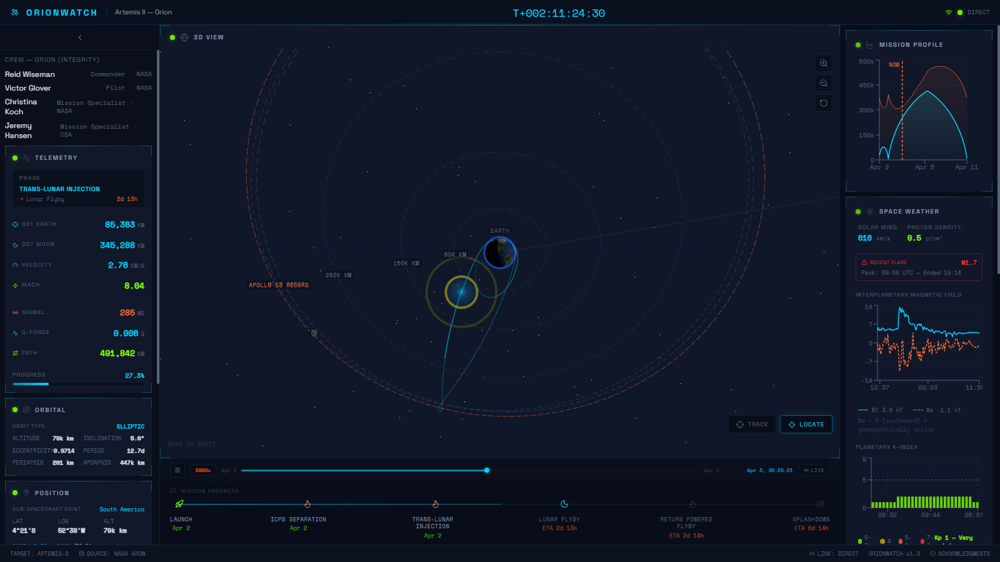
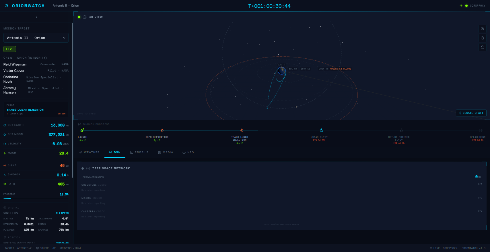
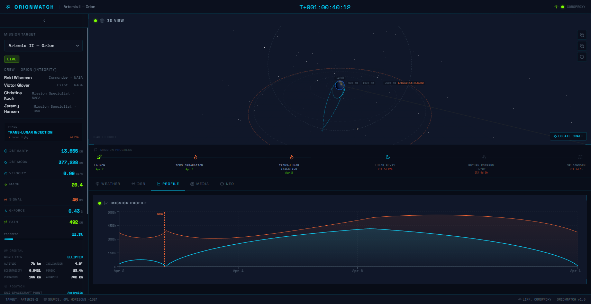
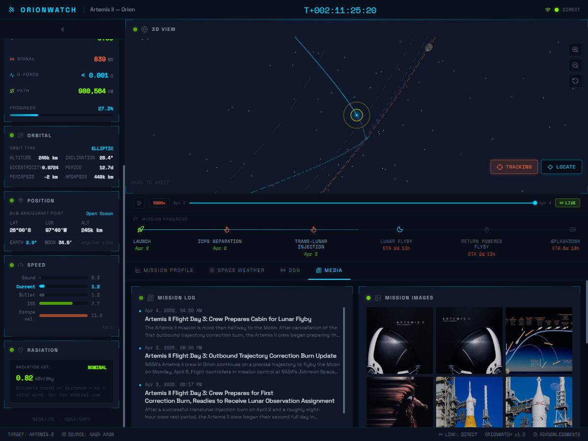

# OrionWatch

Real-time space mission dashboard tracking Artemis II and other active spacecraft. Built as a pure frontend SPA consuming only public APIs — no backend, no auth, no secrets.

   

## Screenshots

### Main Dashboard — 3D View + Space Weather


### Deep Space Network Status


### Mission Profile Chart


### Media — Blog, Images, DSCOVR Earth, APOD


## Features

### Mission Tracking
- **6 mission targets**: Artemis II (live), Artemis I (historical), ISS, Voyager 1, James Webb Space Telescope, Demo (offline)
- **Real-time telemetry** from JPL Horizons API: position, velocity, distance from Earth/Moon
- **Derived metrics**: Mach number, signal delay, G-force, cumulative path distance, mission progress %
- **Orbital elements**: semi-major axis, eccentricity, inclination, period, periapsis/apoapsis
- **Ground track**: sub-spacecraft latitude/longitude with region identification
- **Angular size**: Earth and Moon apparent size from spacecraft perspective

### 3D Visualization
- Interactive Three.js scene with Earth (textured), Moon, and spacecraft
- Full mission trajectory with color gradient (past) and dashed prediction (future)
- Moon orbital path visualization
- Distance reference rings (60k, 150k, 280k, 384k km + Apollo 13 record at 400,171 km)
- Sun direction indicator and ecliptic reference grid
- Starfield with twinkle animation
- Spacecraft oriented along velocity vector
- Zoom/pan/orbit controls with "Locate Craft" button

### Space Weather
- **NOAA SWPC data**: 24-hour solar wind (Bt/Bz magnetic field), plasma speed/density
- **Planetary K-index**: color-coded bar chart with storm level indicators
- **Solar flare alerts**: real-time GOES X-ray flare classification (B/C/M/X)
- **Aurora forecast**: OVATION model with visibility latitude estimates
- **Crew radiation estimate**: empirical model based on distance + Kp + solar wind

### Deep Space Network
- Live antenna status from NASA DSN Now API
- Three stations: Goldstone, Madrid, Canberra
- Per-dish signal direction, data rate, and tracked spacecraft

### Additional Data
- **Near Earth Objects**: daily count from NASA NEO API with closest approach details
- **Earth from DSCOVR**: real EPIC camera photo from Lagrange point L1
- **Astronomy Picture of the Day**: NASA APOD integration
- **Mission blog**: RSS feed from NASA Artemis blog
- **Mission images**: NASA Images API search

### Interface
- Enterprise-grade layout: dense sidebar with all metrics, maximized 3D scene, tabbed secondary content
- HUD-style panel design with corner brackets and cyan/amber accent system
- Lucide React icons throughout
- Dark space aesthetic (Space Grotesk + Space Mono typography)
- Fully responsive (desktop + mobile)
- Zero scroll for critical data on desktop

## Tech Stack

| Layer | Technology |
|---|---|
| Framework | React 19 + Vite 6 |
| Language | TypeScript (strict mode) |
| 3D | Three.js 0.172 |
| Charts | Recharts 2 |
| State | Zustand 5 |
| Styling | Tailwind CSS 4 |
| Icons | Lucide React |
| Orbital | satellite.js 5 (ISS only, dynamic import) |

## Technical Solutions

### Dual Data Pipeline: AROW + Horizons

The dashboard consumes two complementary data sources for Artemis II. **NASA AROW** (Artemis Real-time Operations Window) provides live Mission Control telemetry via Google Cloud Storage — CORS-native, no proxy needed, updated every ~60 seconds with actual flight data (position, velocity in feet, converted to metric). **JPL Horizons** provides pre-computed ephemeris with 10-minute resolution for the full 10-day mission arc. AROW drives the sidebar telemetry numbers (real measurements); Horizons drives the 3D trajectory and spacecraft visualization (smooth, self-consistent path). This avoids the ~43,000 km offset between actual vs predicted ephemeris that would cause the craft to visually detach from its trajectory.

### Server-Side Trajectory Collection

Horizons API doesn't support browser CORS reliably. Instead of runtime proxies, PHP cron jobs (`cron/record-telemetry.php`, `cron/backfill-trajectory.php`) pre-fetch trajectory data server-side and write static JSON files (`trajectory-full.json` with 1,284 records, `moon-trajectory.json` with 428 records). The frontend loads these once — no repeated API calls, no CORS issues, instant availability.

### Cubic Hermite Interpolation for Playback

Horizons data comes at 10-minute intervals. Naive linear interpolation produces visible speed pulsing during playback. The solution uses **cubic Hermite splines** with velocity tangents at both endpoints:

```
H(t) = (2t³-3t²+1)·p₀ + (t³-2t²+t)·v₀·Δt + (-2t³+3t²)·p₁ + (t³-t²)·v₁·Δt
```

This leverages the velocity vectors already present in the state data to produce physically smooth C¹-continuous motion between samples.

### Centripetal Catmull-Rom Trajectory Rendering

The 3D trajectory line uses centripetal parameterization (α=0.5) for Catmull-Rom spline subdivision. Standard uniform Catmull-Rom produces cusps and overshoots near Earth where data points are dense and the orbit curves sharply. Centripetal parameterization distributes control points by the square root of chord length, eliminating the trajectory-through-Earth artifact that uniform splines produce near perigee.

### Real Lunar Orbital Plane

Distance reference rings and Moon orbit are aligned to the **actual lunar orbital plane**, computed from the cross product of two real Moon position vectors (from Horizons body 301 data). This replaces a hardcoded 28.5° inclination approximation and ensures rings visually match the Moon's true path throughout the mission.

### External Time Control Pattern

The 3D scene (`SceneCore`) runs its own animation loop for real-time rendering. During playback, a separate RAF loop in `ThreeScene` controls Moon/Sun positions at simulated time. Without coordination, both loops would fight over Moon position — causing visible jumping. The `externalTimeControl` flag gates SceneCore's own Moon/Sun updates, giving the playback loop exclusive control during simulation.

### Texture Loading without CORS Headers

Shared hosting doesn't send CORS headers for static assets. Three.js `TextureLoader` sets `crossOrigin="anonymous"` by default, which triggers a CORS preflight that fails. The fix bypasses TextureLoader entirely: textures load via a raw `new Image()` element (no crossOrigin attribute), then wrap as `new THREE.Texture(img)`. The browser loads the image as a simple same-origin request.

### Performance: Pre-allocated Objects & Throttled Updates

The playback loop runs at 60fps but only writes to Zustand telemetry store at ~4Hz (every 15th frame) and updates Sun position every 30th frame. Trajectory point arrays are cached in refs to avoid re-spreading every frame. Three.js geometries use pre-allocated `BufferGeometry` with direct position updates instead of creating new objects. This keeps heap allocation flat over long playback sessions.

### Responsive Bloomberg Layout

Desktop (xl+) uses a 3-column layout inspired by Bloomberg Terminal: dense telemetry sidebar (w-64), maximized 3D scene with playback controls, and a right panel with all secondary data (Mission Profile, Space Weather, DSN) — zero tabs, everything visible simultaneously. Below xl, content falls back to a tabbed interface. Mobile uses a bottom-sheet drawer triggered by hamburger menu. All critical data is visible without scrolling on desktop.

## Data Sources

| Source | API | Update Rate |
|---|---|---|
| Spacecraft state vectors | JPL Horizons | 60s |
| Solar wind / Kp index | NOAA SWPC | 60s |
| Solar flares | NOAA GOES | 60s |
| Aurora forecast | NOAA OVATION | 120s |
| DSN antenna status | NASA DSN Now | 10s |
| ISS position | Celestrak TLE + SGP4 | 10s |
| Mission images | NASA Images API | 300s |
| Near Earth Objects | NASA NEO API | 600s |
| Earth photo | NASA EPIC/DSCOVR | 600s |
| Astronomy POTD | NASA APOD | 3600s |
| Mission blog | NASA RSS via rss2json | 120s |

## CORS Strategy

Since all APIs are fetched directly from the browser:

1. **Direct fetch** (4s timeout)
2. **Cloudflare Worker proxy** (if `VITE_HORIZONS_PROXY_URL` env var is set)
3. **Public CORS proxies**: allorigins.win, corsproxy.io
4. **Demo fallback**: after 3 consecutive failures, auto-switches to simulated data

## Getting Started

```bash
# Install dependencies
npm install

# Start development server
npm run dev

# Production build
npm run build
```

The app works out of the box with no configuration. All APIs are public and unauthenticated.

### Optional: Cloudflare Worker Proxy

For more reliable Horizons API access, deploy a minimal Cloudflare Worker and set:

```
VITE_HORIZONS_PROXY_URL=https://your-worker.workers.dev
```

## Performance

| Metric | Value |
|---|---|
| Initial JS bundle | ~82 kB gzipped |
| Three.js chunk (lazy) | ~126 kB gzipped |
| Recharts chunk (lazy) | ~114 kB gzipped |
| Target frame rate | 60 fps |
| Time to Interactive | < 2.5s |

Three.js and Recharts are lazy-loaded after first paint. satellite.js is dynamically imported only when the ISS target is selected.

## Project Structure

```
src/
  layouts/          # DashboardLayout, Sidebar, PanelGrid, TopBar, BottomBar
  components/
    ui/             # Panel, TabBar, StatusDot, PanelSkeleton, Toast
    telemetry/      # PositionMetrics, SidebarTelemetry, OrbitalElements, GroundTrack
    mission/        # TargetSwitcher, MilestoneTimeline, CrewCard
    weather/        # SpaceWeatherPanel
    dsn/            # DsnPanel
    media/          # ImageFeed, BlogFeed, EpicEarth, NeoPanel, ApodPanel
    scene/          # SceneContainer
  scene/            # Three.js: SceneCore, Earth, Moon, Spacecraft, Trajectory, DistanceRings
  charts/           # SolarWindChart, KpIndexChart, DistanceChart
  data/
    targets/        # Mission configs: artemis-2, artemis-1, iss, voyager-1, webb, demo
    adapters/       # API parsers: horizons, noaa, dsn, epic, neo, apod, aurora, solar-flares
    hooks/          # useSpaceWeather, useDsn, useExtraData
    utils/          # CORS fallback, polling
  store/            # Zustand: useTargetStore, useTelemetryStore, useDashboardStore
  styles/           # globals.css, animations.css
```

## Author

**Francesco di Biase**

## License

MIT
